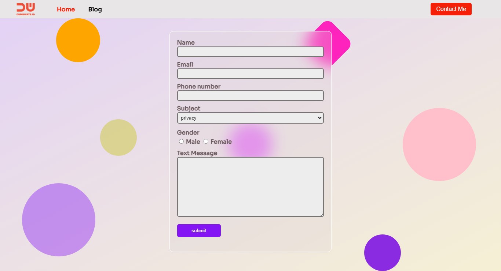

# [click here](https://app.netlify.com/sites/dhyno/overview)
result from day 7 with some feature and i use glassmorphism for my web because it elegant and simple\
## Theme
form theme from [RH](https://dribbble.com/shots/14778687-Glassmorphism-Header-Concept)\
color theme from [Piyush Kumar Singh](https://dribbble.com/shots/15272958-Tours-Mobile-App-Design)\
button navbar from [Designer](https://dribbble.com/shots/15562476-Playit-E-sports-Tournaments-Landing-page)\
background theme from [Olga Furmanchuk](https://dribbble.com/shots/15283880-Subscribe)\
aniamation from [online youtube tutorial](https://www.youtube.com/watch?v=hf3Ncq3UX6c)
## review

